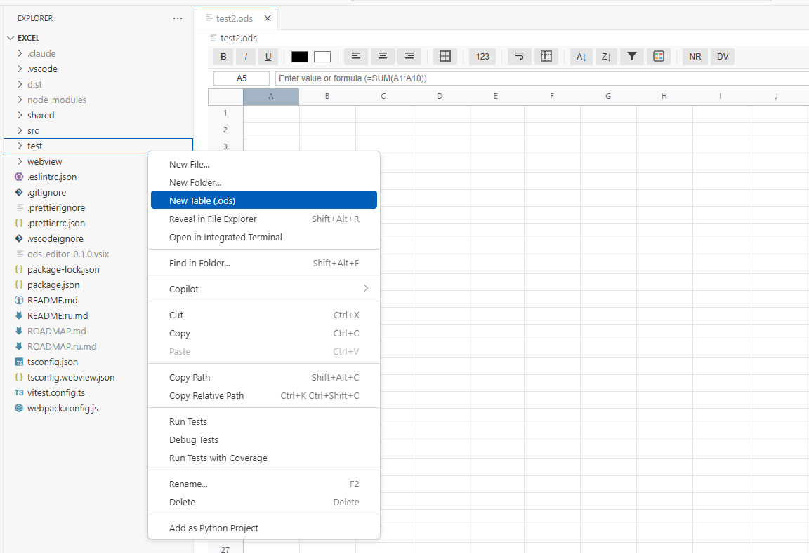
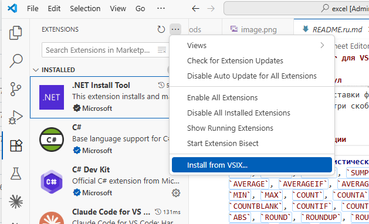

# ODS Spreadsheet Editor for VSCode

[Русская версия](README.ru.md)

## How to install

Full-featured OpenDocument Spreadsheet (.ods) editor, built natively into VSCode. No external apps required.

## Quick Start

1. Open any `.ods` file in VSCode
2. Or right-click a folder in Explorer > **New Table (.ods)** to create from template

---

## Features

### Cell Editing
- **Direct input** -- click a cell and start typing, or press `F2` / `Enter` to edit
- **Formula bar** -- edit cell value or formula in the top bar
- **Formula support** -- `=SUM(A1:A10)`, `=IF(A1>0, "yes", "no")`, `=VLOOKUP(...)`, and 80+ functions
- **Formula autocomplete** -- type `=` then a function name prefix; a dropdown appears with matching functions; navigate with `↑`/`↓`, accept with `Tab` or `Enter`
- **Cross-sheet references** -- `=Sheet2.A1` or `=Sheet2.A1:B10` (ODS dot-notation)
- **Auto-fill** -- drag the fill handle (small square at bottom-right of selection) to extend series: numbers, letters, IP addresses, repeating patterns
- **Cell drag-to-move** -- hold `Alt` and drag a selection to move its contents to a new location
- **Clipboard** -- `Ctrl+C`, `Ctrl+V`, `Ctrl+X` with tab-separated format (compatible with Excel/Google Sheets paste)

### Selection & Navigation
- **Click** a cell to select it
- **Shift+click** or **Shift+Arrow** to extend selection
- **Click column header** (A, B, C...) to select entire column
- **Click row header** (1, 2, 3...) to select entire row
- **Ctrl+A** -- select all cells
- **Tab** / **Shift+Tab** -- move right/left
- **Enter** -- confirm edit and move down
- **Merged cells** -- clicking any part of a merged cell selects the entire merged area

### Formatting Toolbar
| Button | Action |
|--------|--------|
| **B** / **I** / **U** | Bold, Italic, Underline |
| **S̶** (Strikethrough) | Strikethrough text |
| Color pickers | Text color / Background color |
| Alignment icons | Left / Center / Right align |
| Borders dropdown | All borders, Outer, None, Top/Bottom/Left/Right |
| **123** (Number format) | General, Number (1,234.56), Currency ($1,234.56), Percent (12.34%), Date, Integer |
| Wrap text icon | Toggle text wrapping in cells |
| Freeze icon | Freeze/unfreeze rows and columns |
| **A↓** / **Z↓** | Sort ascending / descending |
| Filter icon | Open filter dropdown for selected column |
| Conditional format icon | Open conditional formatting dialog |

### Borders
Click the borders button in the toolbar to open a dropdown with options:
- **All Borders** -- apply borders to all cell edges in selection
- **Outer Borders** -- border only around the perimeter of selection
- **No Borders** -- remove all borders from selection
- **Single side** -- Top, Bottom, Left, or Right border only

### Number Formats
Click **123** in the toolbar:
- **General** -- no formatting (raw value)
- **Number** -- `1,234.56` (thousands separator, 2 decimal places)
- **Currency** -- `$1,234.56`
- **Percent** -- `12.34%` (value is multiplied by 100)
- **Date** -- `2024-01-15` format
- **Integer** -- `1,235` (thousands separator, no decimals)

### Text Wrap
Toggle wrap text to make cell content break into multiple lines within the cell. Combined with vertical alignment (top/middle/bottom), gives control over how long text is displayed.

### Freeze Panes
1. Select the cell at the intersection point -- everything **above** and **to the left** of it will be frozen
2. Click the freeze button (dashed cross icon)
3. Frozen rows/columns stay fixed while scrolling
4. Click again to unfreeze

### Column & Row Resize
- **Drag** the header divider to resize columns or rows
- **Double-click** the column header divider to **auto-fit** width (scans all cells and adjusts to longest content)

### Find & Replace
- **Ctrl+F** -- open Find bar
- **Ctrl+H** -- open Find bar (with Replace field)
- Type to search across all cells; matches are highlighted
- **Enter** / arrows to navigate between matches
- **Replace** / **Replace All** to substitute values
- **Esc** to close

### Filter
1. Select a cell in the column you want to filter
2. Click the filter button (funnel icon) in the toolbar
3. A dropdown appears with **checkboxes for each unique value** in the column
4. Uncheck values you want to hide
5. **Apply** to filter, **Clear** to remove filter, **Cancel** to close
6. Filtered (hidden) rows are skipped during rendering

### Conditional Formatting
1. Select the range of cells to apply the rule to
2. Click the conditional format button (colored squares icon)
3. Choose a condition type:

   **Value-based rules:**
   - **Greater than** / **Less than** -- compare cell value to a number
   - **Equals** / **Not equals** -- exact match
   - **Contains** / **Not contains** -- substring match
   - **Between** -- value is in a range (two values)
   - **Is empty** / **Is not empty** -- null/blank detection
   - Set the formatting style: background color, text color, bold, italic

   **Visual scales:**
   - **Color Scale** -- cells are shaded with a gradient between a min and max color (optional mid-point color); color is proportional to the cell value within the range
   - **Data Bar** -- a colored bar fills each cell proportionally to its value; bar length represents relative magnitude

4. Click **Apply** -- the rule is saved and cells update immediately
5. Existing rules are listed at the bottom of the dialog with a delete button (×)
6. Multiple rules can stack; first matching rule wins

### Cell Comments
- **Add/edit comment**: right-click a cell > **Edit Comment**, type in the dialog, click **Save**
- **Delete comment**: open the comment dialog > **Delete**
- **View comment**: hover over a cell with a red triangle indicator (top-right corner) to see a tooltip
- Comments are saved in the `.ods` file and are compatible with LibreOffice/Google Sheets

### Sort
1. Select a range of cells
2. Click **A↓** for ascending or **Z↓** for descending
3. Sorts the selected range by the active column

### Merge Cells
Right-click a selection > **Merge Cells** to combine multiple cells into one. **Unmerge** to split them back.

### Insert & Delete
Right-click to access:
- **Insert Row Above / Below**
- **Insert Column Left / Right**
- **Delete Row / Column**

### Sheet Management
- **Sheet tabs** at the bottom show all sheets
- Click a tab to switch sheets
- **Double-click** a tab to rename
- **Right-click** a tab to delete
- Click **+** to add a new sheet

### Status Bar
When multiple cells are selected, the bottom-right shows:
- **Sum** -- total of all numeric values
- **Avg** -- average
- **Count** -- number of non-empty cells

---

## CSV Import / Export

### Export to CSV
Run from the command palette (`Ctrl+Shift+P`) > **ODS: Export Active Sheet to CSV**

Saves the currently active sheet as a `.csv` file (RFC-4180 compliant). Fields containing commas, quotes, or newlines are automatically quoted.

### Import from CSV
- Right-click any `.csv` file in the Explorer > **Import CSV as ODS**
- Or run `Ctrl+Shift+P` > **ODS: Import CSV as ODS**

Creates a new `.ods` file in the same directory and opens it in the editor. Numbers are auto-detected and stored as numeric values.

---

## Templates

### Built-in Templates
When creating a new table (right-click folder > **New Table**), choose from:

| Template | Description |
|----------|-------------|
| **Blank** | Empty spreadsheet |
| **Budget** | Monthly budget with Income/Expenses categories, 12 months, currency format |
| **Invoice** | Invoice layout with Bill To, line items, quantities, amounts, total |
| **Timesheet** | Weekly timesheet with days, start/end times, break, hours |
| **Contacts** | Address book with name, email, phone, company, address fields |
| **Project Tracker** | Task list with #, task, assignee, priority, status, due date |

### Custom Templates
Save any spreadsheet as a reusable template:

1. Open the `.ods` file you want to use as a template
2. Run command palette (`Ctrl+Shift+P`) > **ODS: Save Current as Template**
3. Enter a template name and optional description
4. The template now appears in the **New Table** template picker under "Custom Templates"

Custom templates store the complete `.ods` file (data, styles, formulas, formatting) and are available across all workspaces.

---

## Formulas

### Formula Autocomplete
When typing a formula starting with `=`, a dropdown appears showing matching function names as you type. Use `↑`/`↓` to navigate, `Tab` or `Enter` to insert the function (cursor is placed inside the parentheses), `Esc` to dismiss.

### Supported Functions

**Math & Statistics:** `SUM`, `SUMIF`, `SUMIFS`, `SUMPRODUCT`, `AVERAGE`, `AVERAGEIF`, `AVERAGEIFS`, `MIN`, `MAX`, `COUNT`, `COUNTA`, `COUNTBLANK`, `COUNTIF`, `COUNTIFS`, `ABS`, `ROUND`, `ROUNDUP`, `ROUNDDOWN`, `CEILING`, `FLOOR`, `MOD`, `POWER`, `SQRT`, `PI`, `RAND`, `RANDBETWEEN`, `INT`, `SIGN`, `LOG`, `LOG10`, `LN`, `EXP`

**Financial:** `PMT`, `PV`, `FV`, `NPV`, `IRR`, `RATE`, `NPER`, `SLN`

| Function | Description |
|----------|-------------|
| `PMT(rate, nper, pv, [fv], [type])` | Periodic payment for a loan |
| `PV(rate, nper, pmt, [fv], [type])` | Present value of an investment |
| `FV(rate, nper, pmt, [pv], [type])` | Future value of an investment |
| `NPV(rate, value1, ...)` | Net present value of cash flows |
| `IRR(values, [guess])` | Internal rate of return |
| `RATE(nper, pmt, pv, [fv], [type], [guess])` | Interest rate per period |
| `NPER(rate, pmt, pv, [fv], [type])` | Number of payment periods |
| `SLN(cost, salvage, life)` | Straight-line depreciation |

**Text:** `LEN`, `LEFT`, `RIGHT`, `MID`, `UPPER`, `LOWER`, `TRIM`, `CONCATENATE`, `SUBSTITUTE`, `FIND`, `SEARCH`, `REPLACE`, `REPT`, `TEXT`, `VALUE`, `EXACT`, `T`

**Logic:** `IF`, `AND`, `OR`, `NOT`, `IFERROR`, `ISBLANK`, `ISNUMBER`, `ISTEXT`, `TRUE`, `FALSE`

**Lookup:** `VLOOKUP`, `HLOOKUP`, `INDEX`, `MATCH`, `CHOOSE`, `ROW`, `COLUMN`, `ROWS`, `COLUMNS`

**Date:** `TODAY`, `NOW`, `DATE`, `YEAR`, `MONTH`, `DAY`

### Reference Syntax
- Cell: `A1`, `$A$1` (absolute)
- Range: `A1:B10`
- Cross-sheet: `Sheet2.A1`, `Sheet2.A1:B10`
- ODS bracket: `[.A1]`, `[.Sheet2.A1]`

---

## Keyboard Shortcuts

| Shortcut | Action |
|----------|--------|
| `F2` or `Enter` | Start editing cell |
| `Esc` | Cancel editing |
| `Tab` / `Shift+Tab` | Move right / left |
| `Enter` / `Shift+Enter` | Move down / up |
| `Arrow keys` | Navigate cells |
| `Shift+Arrow` | Extend selection |
| `Ctrl+A` | Select all |
| `Ctrl+C` / `Ctrl+V` / `Ctrl+X` | Copy / Paste / Cut |
| `Ctrl+B` | Bold |
| `Ctrl+I` | Italic |
| `Ctrl+U` | Underline |
| `Ctrl+F` / `Ctrl+H` | Find / Find & Replace |
| `Delete` / `Backspace` | Clear cell content |
| `Home` | Go to column A in current row |
| `Ctrl+Home` | Go to cell A1 |
| `End` | Go to last used cell in current row |
| `Ctrl+End` | Go to last used cell in sheet |
| `Page Up` / `Page Down` | Scroll one page up / down |
| `Alt`+drag | Move selection to new location |
| Address bar + `Enter` | Navigate to typed address (e.g. `B5`, `A1:C10`) |

---

## File Format

This extension works with **OpenDocument Spreadsheet (.ods)** files -- an open standard used by LibreOffice Calc, Google Sheets (export), and other applications. Files can be freely exchanged between this editor and any ODS-compatible application.
